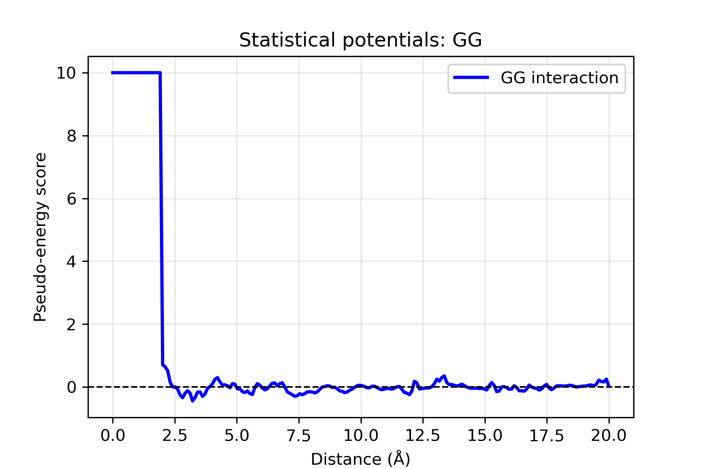
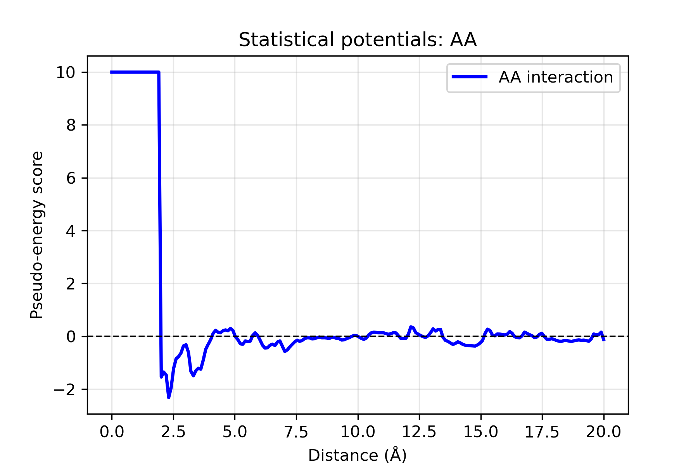
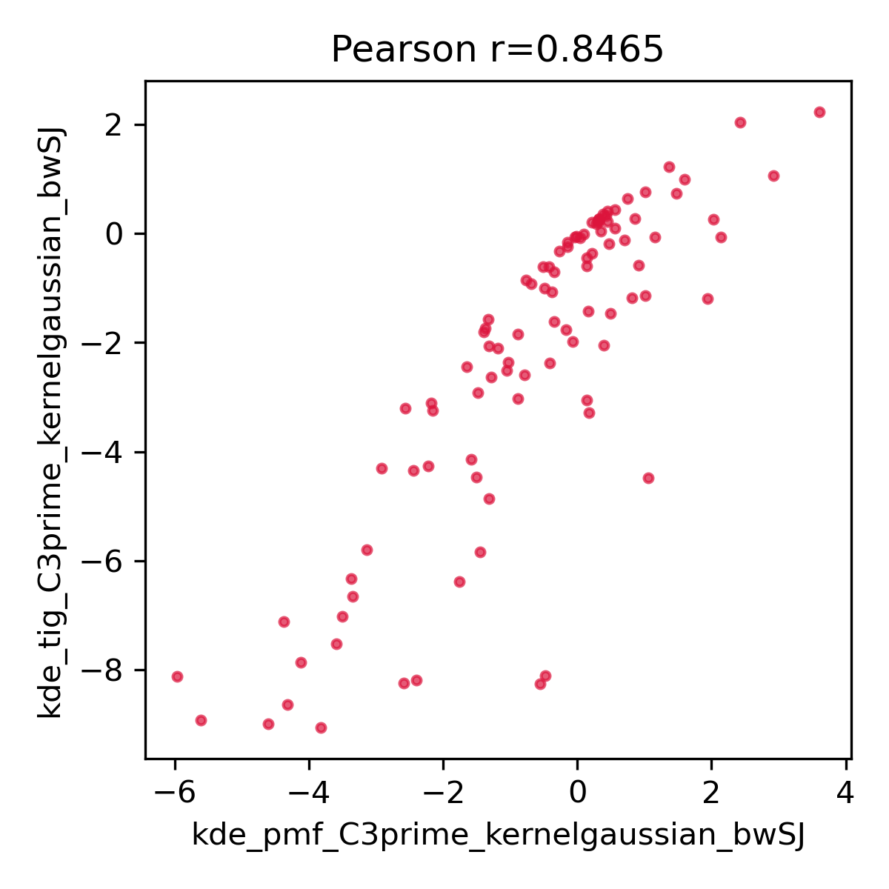
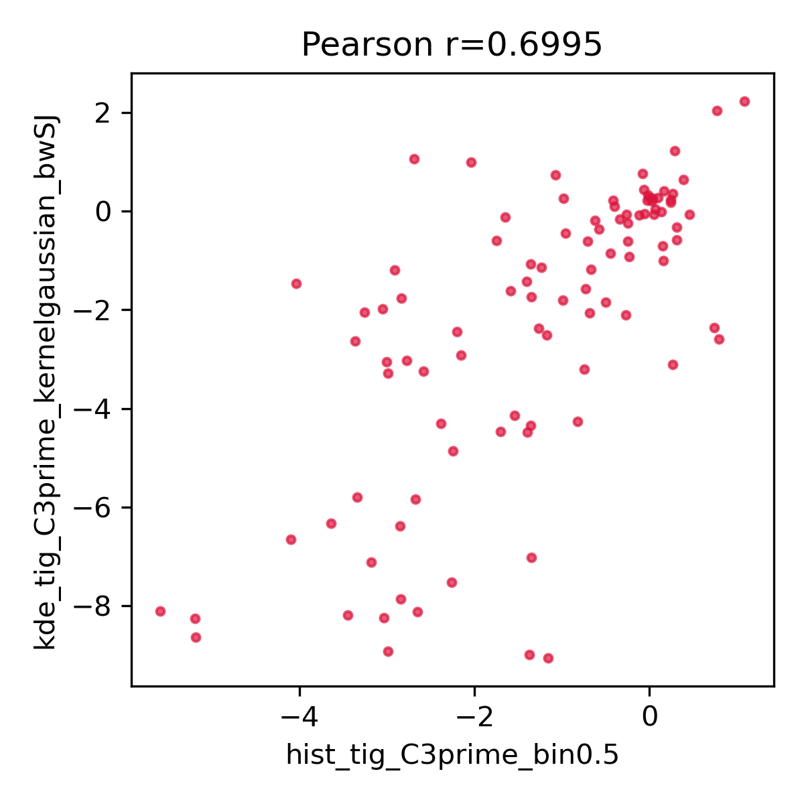

# RNA statistical potentials: knowledge-based scoring function

**Course: Bioinformatics of RNA and non-coding world**

**M2 GENIOMHE - Univ Evry Paris-Saclay**

**Year: 2025-2026**

**Authors:**  
- Minh Ngoc VU  
- Erine BENOIST


## Table of content
- [Overview](#overview)
- [Developments](#developments)
- [Installation & requirements](#installation--requirements)
- [Usage](#usage)
  - [Data acquisition](#data-acquisition)
  - [Training the objective function](#training-the-objective-function)
  - [Plot interaction profiles](#plot-interaction-profiles)
  - [Scoring for a given function](#scoring-for-a-given-function)
  - [Comparing scoring results of different profiles](#comparing-scoring-results-of-different-profiles)
- [Methodology](#methodology)


## Overview

For a given ribonucleotide chain, the RNA folding problem consists of finding the native fold among an astronomically large number of possible conformations. The native fold is generally considered the one with the lowest Gibbs free energy.

The goal of this project is to develop an objective function (scoring function) to estimate this energy. By evaluating the “pseudo-energy” of a conformation, we can determine how close a predicted structure is to the optimal/native fold.

Our scoring function is a statistical potential derived from experimentally determined RNA structures. It relies on the inverse Boltzmann principle, calculating pseudo-energies based on the frequency of atomic interactions observed in nature.


## Developments
- *Dec 4, 2025*: First working version (distance, training with histogram, plotting). Training variables are set as users' input parameters
- *Dec 5, 2025*: Allowed training with Kernel density estimates with R backend
- *Dec 22, 2025*: Two scoring functions are now allowed: total information gain (TIG, non-log) and potential mean of force (PMF, log). Added comparative analysis of scoring results based on different profiles


## Installation & requirements

The project was developed using python 3.12.

### 1. Dependencies

Install the required packages using pip:

```bash
pip install biopython numpy scipy matplotlib scikit-learn rpy2
```

### 2. Project structure

- `train.py` — Central entry point, handles CLI arguments and orchestrates the training process  
- `plot.py` — Plot profiles
- `scoring.py` — Scoring on a given structure
- `rna_loader.py` — Parses PDB and CIF files using BioPython  
- `rna_distance.py` — Computes Euclidean distances and filters invalid/non-RNA chains  
- `rna_training.py` — Core statistical potential logic (Histograms + KDE)  
- `rna_downloader.py` — Downloads structures via the RCSB PDB API  
- `utils.py` — Helper functions (file saving, formatting, etc.)


## Usage

### 1. Data acquisition

RNA structures can be downloaded using:

```bash
python rna_downloader.py
```
This will create an `rna_data/` folder containing PDB and mmCIF files.

For training, we obtained 114 RNA structures via the [RCSB PDB REST API](https://www.rcsb.org/docs/programmatic-access/web-apis-overview). Each structure was downloaded in both PDB and CIF format.


### 2. Training the objective function

Users can also specify atom of choice and mmCIF format. The project currently supports single-atom distances. Two scoring functions are: total information gain (TIG, non-log) and potential mean of force (PMF, log) ([Postic et al. 2020](https://linkinghub.elsevier.com/retrieve/pii/S2001037020303664)). 

This section demonstrates 2 training scenarios. Other scenarios have been explored and their profile results can be viewed at `profiles/`.

#### Case 1: Training with histogram with bin_size=0.5 using the formula PMF

```bash
python train.py --data data/pdb --format pdb \\
        --mode histogram --bin_size 0.5 \\
        --atom "C3'" --formula pmf
```
The output directory is created automatically with the key parameters (`profiles/hist_pmf_C3prime_bin0.5` in this case) if not specified otherwise.

#### Case 2: Training with Kernel Density Estimation (KDE) using the formula TIG

Kernel Density Estimation is applied using R's `stats.density` imported to Python via the `rpy2` package. 

Using KDE with bandwidth="SJ" or a scalar (e.g. 0.1). Different kernel types are also supported. 

```bash
python train.py --data data/cif --format cif \\
        --mode kernel --kernel_type triangular --bandwidth 0.1 \\
        --atom "C3'" --formula tig

python train.py --data data/pdb --format pdb \\
        --mode kernel --kernel_type gaussian --bandwidth "SJ" \\ 
        --atom "C3'" --formula tig
```

| Parameter | Description | Default |
|----------------|-------------|---------|
| `-d, --data` | Path to structure folder | Required |
| `-f, --format` | File format (`pdb` or `cif`) | pdb |
| `-m, --mode` | Calculation method (`histogram` or `kernel`) | histogram |
| `-a, --atom` | Atom used for distance calculation | C3' |
| `-o, --out_dir` | Output directory | profiles |
| `--max_dist` | Maximum distance threshold (Å) | 20.0 |
| `--min_dist` | Minimum distance threshold (Å) | 0.0 |
| `--bin_size` | Histogram bin size | 1 |
| `--bandwidth` | Bandwith for KDE (scalar, 'nrd0', 'SJ', 'nrd', 'ucv', or 'bcv') | SJ |
| `--kernel_type` | Kernel type for KDE ("gaussian", "rectangular", "triangular", "epanechnikov", "biweight", "cosine", "optcosine") | gaussian |
| `--formula` | Scoring function formula: 'pmf' (potential of mean force) or 'tig' (total information gain) | tig |


### 3. Plot interaction profiles

```bash
python plot.py --input profiles/kde_tig_C3prime_kernelgaussian_bwSJ --output plots/kde_tig_C3prime_kernelgaussian_bwSJ
```

Parameters:  
- `--input` : Folder containing .txt scoring profiles
- `--output`: Folder where .png plots will be saved  

Example plots (KDE, TIG, Gaussian kernel, bandwidth SJ):

 


### 4. Scoring on a given structure 

Scoring based on the trained profiles (histograms and KDE). We can compare the estimated scores produced by 2 different profiles, one used the PMF and the other used the TIG formula:

```bash
python scoring.py --structure_dir data/pdb/1AL5.pdb --profile_dir profiles/kde_pmf_C3prime_kernelgaussian_bwSJ

python scoring.py --structure_dir data/pdb/1AL5.pdb --profile_dir profiles/kde_tig_C3prime_kernelgaussian_bwSJ
```
Parameters:  
- `--structure_dir`: RNA structure file in PDB or mmCIF
- `--profile_dir`: path to where the profiles are stored 

Results: 
```bash
Reading profiles from 'profiles/kde_pmf_C3prime_kernelgaussian_bwSJ'...
Structure: data/pdb/1AL5.pdb
Estimated Gibbs free energy: -0.141

Reading profiles from 'profiles/kde_tig_C3prime_kernelgaussian_bwSJ'...
Structure: data/pdb/1AL5.pdb
Estimated Gibbs free energy: -0.237
```

### 5. Comparing scoring results of different profiles

We also allow to perform simultaneous scoring on multiple RNA structures using different profiles. If multiple profiles a uresed, Pearson correlation is calculated between all pairs of profiles. 

This command scored all 114 RNA structures using 6 profiles, 2 from histogram and 4 from KDE, both PMF and TIG functions were used: 

```bash
python scoring_comparison.py --structure_dir data/pdb \\
    --profile_dir profiles/hist_tig_C3prime_bin0.5 \\
        --profiles/hist_pmf_C3prime_bin0.5 \\
        --profiles/kde_tig_C3prime_kernelgaussian_bw0.1 \\
        --profiles/kde_pmf_C3prime_kernelgaussian_bw0.1 \\
        --profiles/kde_tig_C3prime_kernelgaussian_bwSJ \\
        --profiles/kde_pmf_C3prime_kernelgaussian_bwSJ
```

Scoring results and correlation plots are saved into `scoring_comparison/`. Ideally the scores should be negative. We noticed the scores of some structures are extremely low (e.g. 1FFZ was scored -174.95 using KDE with the TIG formula). Some of these structures are large ribosomal units, RNAs from bacteriophage, etc. In addition, even though we aimed to collect RNAs from *Homo sapiens* only, the query we used was not optimal and therefore we collected several RNA structures from other organisms (e.g., *E.coli*). It is possible that these structures would have poorer scoring results, given that we have observed most structures with positive scores belong to these organisms. A better data selection approach might be needed to enhance the training quality. 

 


## Methodology

### 1. Data loading & cleaning

- Uses **Biopython** to parse structures  
- Handles **both PDB and CIF formats**  
- Selects **Model 0** for NMR files  
- Removes chains containing:
  - amino acids  
  - DNA  
  - modified bases  
  - ambiguous nucleotide “N”  

Only **pure RNA chains** are kept for training.


### 2. Distance calculation

We define an “interaction” as:

- Measured between **C3' atoms**  
- Only **intrachain** interactions  
- Residue separation ≥ 3 positions

This avoids trivial backbone-local interactions.


### 3. The objective function

The statistical potential can be computed using the inverse Boltzmann principle. This is the "potentials of mean force" (PMF) formula:

$$
u(r) = -\log\left(\frac{f_{ij}^{Obs}(r)}{f_{XX}^{Ref}(r)}\right)
$$

Where:

- $f_{ij}^{Obs}(r)$: Observed probability of interacting pair $i-j$ at distance $r$
- $f_{XX}^{Ref}(r)$: Reference state probability (any pair at distance $r$)

Another formula employed in this project was proposed by [Postic et al. 2020](https://linkinghub.elsevier.com/retrieve/pii/S2001037020303664), termed "total information gain" (TIG):

$$
u(r) = -\sum\left(\frac{f_{ij}^{Obs}(r) - f_{XX}^{Ref}(r)}{f_{XX}^{Ref}(r)}\right)
$$

**Interpretation of the score:**

- **Negative** → interaction more frequent than random → **favorable**  
- **Positive** → interaction less frequent than random → **unfavorable**

